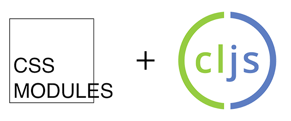

# CSS Modules in ClojureScript



A sample ClojureScript project showcasing a workflow with live-reloadable [CSS Modules](http://glenmaddern.com/articles/css-modules) using Gulp & Figwheel.

## How It Works

The basic premise is as follows:

1. A Gulp task watches and compiles your CSS Modules to JS.
    * *Note: CSS Module namespaces to be exported are defined in `src/clojurescript_css_modules_demo/css/settings.js`.*
2. This JS file is hooked into your CLJS app through a `foreign-lib` named `cssModules`.
3. Figwheel reloads your project whenever it detects changes to `cssModules`.
4. This module is exposed to your CLJS project, allowing you to easily access the class names of your CSS Modules.
    * *Note: a helper macro is provided for use with Reagent's hiccup-style syntax, but you can use this flow with any CLJS project.*

## Installation
Clone, `npm install` and `gulp watch` in one REPL.
`lein figwheel` in another REPL.
Change your .css modules within `src/css/` and notice how Gulp/Figwheel live reload your project.

Note: Remember to change `css/settings.js` if you add additional CSS Module namespaces.


## Usage With Reagent
At first - import CSS modules to project with foreign-libs. After it you can use `aget` to lookup and replace classes in Reagent templates with the correct css classes from your files.


For example: in `filename.css` we get CSS rule with selector `.logo`:

```clojure
(defn my-component[]
	[:div { :class-name (aget js/cssModules "filename" "logo") }])
```

#### Syntax Sugar

There is a pretty syntax sugar inside demo:

```clojure
(defn my-component[]
	(get-css 
		[:div.CSS>filename>logo]))
```

Which is equivalent to code above. Or you can use macro `defcomponent` which wraps your component function with `get-css`.

```clojure
(defcomponent my-component[]
	[:div.CSS>filename>logo])
```

## TODO:
* [ ] Expand on this documentation!
* [ ] Structure CSS Modules, add advanced examples.
* [ ] Explore making this a standalone Clojure plugin (thereby removing the NodeJS/Gulp dependency).

Contributions welcome!